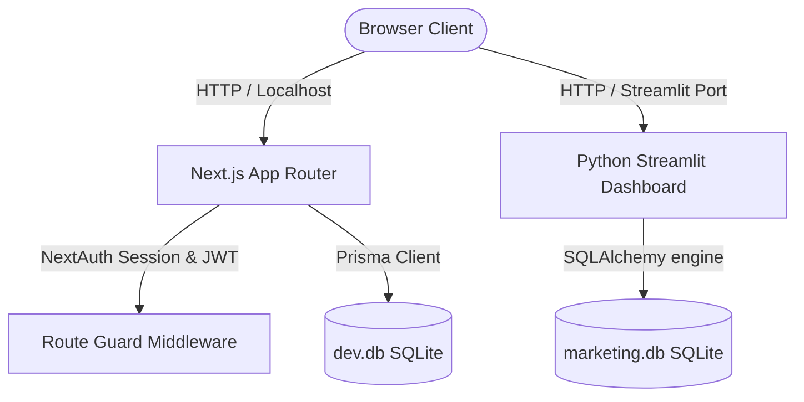
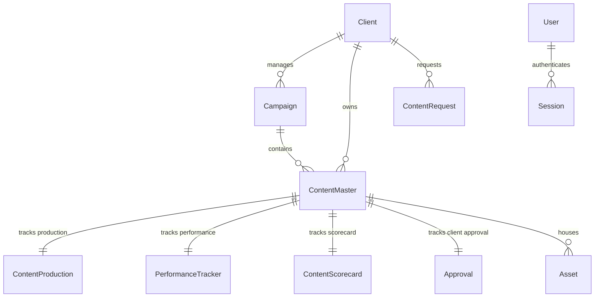

# Project Report & End-to-End Documentation: Quantira Content OS

## Executive Summary
**Quantira Content OS** is a central command center and collaborative pipeline platform designed to bridge the gap between digital marketing agencies and their clients. By automating the tracking of content production, client approvals, and analytics ingestion, the system eliminates email chains, fragmented spreadsheets, and communication latency.

The system features two main dashboard experiences:
1. **Next.js Client Portal Dashboard**: A secure, modern client-facing interface that provides transparency on scheduled content, allows clients to submit brand briefs, and displays live performance metrics (leads, reach, revenue).
2. **Next.js Agency Admin Console & Python Streamlit Admin Console**: Workspaces for account managers, copywriters, designers, and video editors to coordinate drafts, manage assets, score content quality, and verify publishing schedules.

---

## 1. System Architecture & Tech Stack

The application uses a modern, robust, and highly performant architecture to handle both complex content operations and high-speed reporting dashboards:



### Core Technologies
*   **Web Portal Framework (Next.js 14.2.1)**: Utilizes Next.js App Router for server-side rendering, dynamic API routing, and optimized page delivery.
*   **UI/UX Component System (Ant Design & Lucide-React)**: Out-of-the-box, premium UI components (Tables, Cards, Statistics, Calendars) with a custom CSS design system.
*   **Styling (TailwindCSS & Vanilla CSS)**: Provides a premium look using dark modes, smooth typography (`Inter`), and modern spacing systems.
*   **Database & ORM Layer (Prisma & SQLite)**: The relational database schemas are mapped via Prisma ORM for safety, querying ease, and seeding.
*   **Authentication & Security (NextAuth.js)**: Utilizes JWT session tokens and cookie middleware for role-based access control (RBAC).
*   **Alternative Analytics Portal (Python Streamlit 1.58.0)**: Uses Streamlit, Pandas, and Plotly to generate analytical dashboards and campaign telemetry.

---

## 2. Database Model & Schema Architecture

Quantira Content OS relies on a fully relational SQLite database model. Below are the key tables and fields managed by the Next.js portal (defined in the Prisma Schema):

### Entity-Relationship Diagram (Conceptual)


### Table Definitions

#### 1. `Client`
Tracks onboarding clients, industry classifications, and financials.
*   `id` (Int, PK, Auto-increment)
*   `clientId` (String, Unique) - Human-readable ID (e.g., `C001`)
*   `clientName` (String, Unique) - Display name (e.g., `Acme Corp`)
*   `industry` (String, Optional)
*   `accountManager` (String, Optional)
*   `monthlyRetainer` (Float) - Active retainer amount
*   `status` (String) - `Active`, `Paused`, `Archived`

#### 2. `Campaign`
Underpins the active initiatives of a client.
*   `campaignId` (String, PK, Unique)
*   `clientName` (FK, links to `Client.clientName`)
*   `campaignName` (String) - e.g., "SaaS Launch Q3"
*   `goal` (String) - Expected outcome
*   `budget` (Float) - Total financial allocation
*   `startDate` / `endDate` (DateTime)
*   `status` (String) - `Planning`, `Active`, `Completed`
*   `expectedLeads` (Int) / `expectedRevenue` (Float)

#### 3. `ContentMaster`
The central registry for every social media and content post.
*   `contentId` (String, PK, Unique)
*   `campaignId` (FK, links to `Campaign.campaignId`)
*   `clientId` (FK, links to `Client.clientName`)
*   `contentTitle` (String) - Headline
*   `platform` (String) - `LinkedIn`, `Twitter`, `Instagram`, `YouTube`
*   `status` (String) - `Draft`, `Planned`, `Published`
*   `healthStatus` (String) - `On Track`, `Delayed`, `At Risk`
*   `caption` / `hashtags` (String, Text bodies)
*   `canvaLink` / `driveLink` (String, Design source files)

#### 4. `ContentProduction`
Granular production states for copywriters, designers, and video editors.
*   `productionId` (Int, PK)
*   `contentId` (FK, links to `ContentMaster.contentId`)
*   `copywriter` (String) / `writerStatus` (e.g. `Draft`, `In Progress`, `Under Review`)
*   `designer` (String) / `designStatus`
*   `videoEditor` (String) / `editingStatus`
*   `revisionCount` (Int)

#### 5. `PerformanceTracker`
Aggregated post-publish telemetry metrics.
*   `contentId` (FK, links to `ContentMaster.contentId`)
*   `reach` (Int)
*   `impressions` (Int)
*   `likes` / `comments` / `shares` / `saves` (Int)
*   `leadsGenerated` (Int)
*   `revenueGenerated` (Float)
*   `engagementRate` (Float)
*   `contentScore` (Float)

---

## 3. User Personas & Role-Based Access Control (RBAC)

NextAuth middleware safeguards route accessibility, ensuring data isolation. Users receive visibility depending on their assigned role:

| Role Name | Access Scope | Primary Actions |
| :--- | :--- | :--- |
| **`ADMIN`** | Unrestricted system-wide access | Manage clients, campaigns, team assignments, financial data, and configurations. |
| **`ACCOUNT_MANAGER`** | Agency operations & client-facing settings | Create campaigns, move content through workflow pipelines, edit clients' retainers. |
| **`COPYWRITER`** | Content Creation pages | Access the draft boards, update captions/hashtags, mark copy as "Submitted". |
| **`DESIGNER`** | Graphics & Asset pages | Access production queues, upload graphic links (Canva/Drive), request sign-offs. |
| **`REVIEWER`** | Audit, quality and compliance tools | Fill in Scorecards (scoring quality out of 10), move content into "Client Portal Ready". |
| **`CLIENT`** | Sandboxed Client Portal `/client-portal` | View metrics, schedule approvals on their own content calendar, submit new briefs. |

---

## 4. End-to-End Operational Workflows

Quantira Content OS implements structured workflows that mimic the operations of high-growth agencies:

```
[Client submits request via Portal] 
               │
               ▼
[Account Manager creates Campaign & Content Draft]
               │
               ▼
[Copywriter drafts caption] ──► [Designer links visual files]
                                          │
                                          ▼
[Internal Reviewer approves & generates Content Scorecard]
                                          │
                                          ▼
[Client signs-off inside Portal Calendar] ──► [Agency Publishes Post]
                                                         │
                                                         ▼
                                       [Performance Analytics ingested & tracked]
```

### 1. The Intake / Request Flow
*   The client logs into **`http://localhost:3001`**, goes to **New Content Request**, and inputs the desired publish platform, content type, objective, date, and detailed brief.
*   A database record is added in `ContentRequest`. The Account Manager receives it and elevates it to a `ContentMaster` item in a campaign.

### 2. The Production Workflow
*   The post is assigned to a **Copywriter** (status turns to `Writing`) and then a **Designer** (status turns to `Designing`). 
*   Creative assets are linked (Canva/Drive URLs are added to the post).

### 3. The Quality Review / Scorecard Workflow
*   A **Reviewer** opens the post, analyzes the assets, and assigns scores for reach potential, engagement style, and lead conversion.
*   The overall score is generated, and the post is marked as `Planned`.

### 4. Client Sign-off & Performance Ingestion
*   The post appears on the client's **Content Calendar**. The client reviews it and changes the approval state to `Approved`.
*   After the post goes live, the **PerformanceTracker** ingests the platform analytics (impressions, clicks, leads generated), dynamically recalculating the total revenue and ROI on the client's main dashboard page.

---

## 5. Local Setup & Execution Guide

### Prerequisites
*   **Node.js**: v18.0.0 or higher (v24.18.0 recommended)
*   **Python**: v3.10 or higher (v3.12.10 recommended)
*   **SQLite**: Handled automatically via file directories.

### Setup Steps

1.  **Clone the Workspace and Open Terminals**
    Ensure you are in the workspace folder:
    `c:\Users\KARTHIKEYA MANTHA\OneDrive - quantiratechnologies com\Documents\kk`

2.  **Initialize the Databases**
    *   Initialize the SQLite database for python reports:
        ```powershell
        python initialize_db.py
        ```
    *   Navigate to the Next.js app directory and sync the Prisma schema:
        ```powershell
        cd quantira-content-os
        npx prisma db push
        npx prisma db seed
        ```

3.  **Configure Environment Variables (`.env`)**
    Ensure `quantira-content-os/.env` contains the following:
    ```env
    DATABASE_URL="file:./dev.db"
    NEXTAUTH_SECRET="f3b90cd9fca12be407982f6e9bb151fa28ad8ef1a7a0bb91845112cc49195b06"
    NEXTAUTH_URL="http://localhost:3001"
    AUTH_TRUST_HOST=true
    ```

4.  **Running the Applications**
    *   **To run the Next.js Client Portal:**
        ```powershell
        npm run dev
        ```
        The server starts on: **`http://localhost:3001`** (since port `3000` is usually reserved).
    *   **To run the Streamlit Database Console:**
        ```powershell
        python -m streamlit run app.py
        ```
        The console starts on: **`http://localhost:8501`**.

---

## 6. Seed Credentials (Quick Reference)

### Next.js Client Portal (http://localhost:3001)
*   **Admin Access**: `admin@quantira.com` / `admin123`
*   **Account Manager**: `manager@quantira.com` / `manager123`
*   **Client Account (Acme)**: `client@acmecorp.com` / `client123`
*   **Client Account (Global Health)**: `client@globalhealth.com` / `client123`

### Streamlit Dashboard (http://localhost:8501)
*   **Admin**: `admin` / `admin123`
*   **Account Manager**: `kartar` / `kartar123`
*   **Copywriter**: `rahul` / `rahul123`
