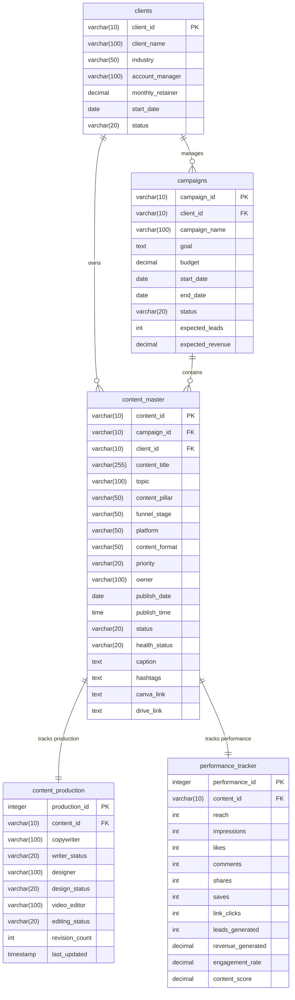

# Marketing Campaign and Content Management Database

This project contains the SQL schema, seed data, and verification scripts for the marketing database using SQLite.

## Files Created

- **`schema.sql`**: The original SQL schema suitable for PostgreSQL, MySQL, or SQLite (uses standard types).
- **`schema_sqlite.sql`**: A SQLite-optimized version of the schema that converts `SERIAL PRIMARY KEY` fields to SQLite's native `INTEGER PRIMARY KEY AUTOINCREMENT` syntax and enables foreign key constraints.
- **`seed_data.sql`**: A dataset containing mock records for clients, campaigns, content master list, content production status, and performance tracking.
- **`verify_queries.sql`**: A suite of SQL queries that runs diagnostic checks, joins the tables to report campaign performance, and verifies that foreign key constraints are correctly enforced.
- **`marketing.db`**: The fully initialized and populated SQLite database.
- **`sqlite3.exe`**: The SQLite command-line tool downloaded directly from the official SQLite repository.
- **`setup_sqlite.ps1`**: The PowerShell script used to fetch the official SQLite CLI tool.

---

## How to Interact with the Database

You can interact with the SQLite database (`marketing.db`) directly using the provided `sqlite3.exe` utility.

### 1. Start the SQLite Command Line Interface
Run this command in your terminal:
```powershell
.\sqlite3.exe marketing.db
```

### 2. Run the Verification Queries
To run the diagnostic reports and check database integrity, execute:
```powershell
Get-Content verify_queries.sql | .\sqlite3.exe marketing.db
```

### 3. Basic SQL Queries

Open the database and try running these queries:

*   **View all tables:**
    ```sql
    .tables
    ```
*   **Toggle pretty column output:**
    ```sql
    .headers on
    .mode column
    ```
*   **Check client records:**
    ```sql
    SELECT * FROM clients;
    ```
*   **Show Campaign Budgets and Goals:**
    ```sql
    SELECT campaign_name, budget, goal FROM campaigns;
    ```

---

## Schema Overview

The database has 5 tables with the following relationships:


